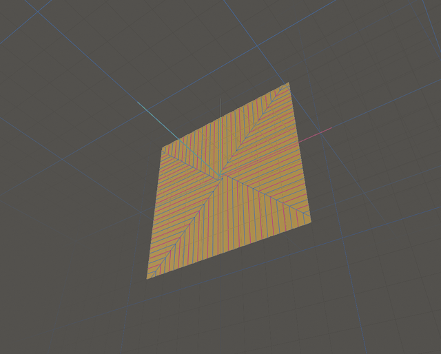
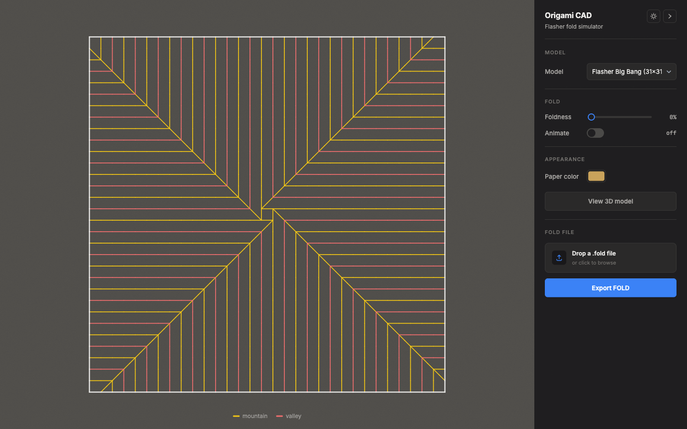

# Origami CAD

A tool for exploring origami "flasher" patterns — the twist-fold designs that
let a large flat sheet collapse down into a small, tidy bundle wrapped around
a central hub. Drag a slider and watch it fold in 3D, anywhere from
completely flat to fully stowed.



The backend (Python, FastAPI) owns all the geometry and fold physics. The
frontend (React, Three.js) just renders whatever the backend hands it — there's
no fold logic on the client at all.

## Key features

- **Parametric flasher generation.** A wrap-pinwheel crease pattern on an
  N×N grid (N has to be odd, so there's one clean square cell sitting right
  at the center). The pattern itself isn't procedurally invented — it's
  transcribed from a real paper model, quartered into four rotationally
  symmetric regions around the hub. The full spec lives in
  `backend/app/flasher/generator.py`.
- **Live fold animation.** Scrub through the fold with a "foldness" slider,
  from 0 (flat) to 1 (fully folded), or let it animate automatically. The
  whole fold trajectory is solved server-side once and interpolated smoothly
  on the client, so dragging the slider is instant.
- **CAD-style crease overlay.** Mountain folds in yellow, valley folds in
  red, borders in a dark neutral — fading out as the paper folds so the
  fully-stowed model reads as plain folded paper rather than a wireframe.

  

- **Two-sided paper rendering.** The front takes whatever color you pick,
  the back stays a plain paper tone — the way real origami paper looks.
- **FOLD file import/export**, so patterns can move between this tool,
  Origami Simulator, and other rigid-origami software (see below).
- **Four presets to try**: 7×7, 15×15, 23×23, and a big 31×31 one.

## Inspiration

Flashers are a real, well-studied family of origami twist-folds — this
project didn't invent the geometry, just tried to build a decent tool for
playing with it. A few things worth knowing about if you want to go deeper
than this README:

- **Jeremy Shafer [YouTube](https://www.youtube.com/@jeremyshaferorigami/videos)**
  is a American entertainer and origamist, a major inspiration for this project
  with his many flasher tutorials and crease patterns.
- **Amanda Ghassaei's [Origami Simulator](https://origamisimulator.org)** is
  a GPU-based fold solver that can animate flasher FOLD files, and it was a
  useful reference for the position-based-dynamics approach this project's
  own solver uses.
- The **[FOLD file format](https://github.com/edemaine/fold)** (more on
  which below) is the shared language that makes it possible to move crease
  patterns between tools like this one, Origami Simulator, and academic
  rigid-origami software at all.

## Project layout

- `backend/app/flasher/generator.py` — crease-pattern generation (pure
  geometry, no physics)
- `backend/app/flasher/solver.py` — the fold simulation
- `backend/app/fold/` — FOLD file format import/export (see below)
- `backend/app/schemas.py` — the API contract (mirrored by hand in
  `frontend/src/model/types.ts`)
- `backend/app/presets.py` — curated flasher presets
- `frontend/src/api/` — typed API client and the geometry-fetching hooks
- `frontend/src/model/` — shared API types and the frame-interpolation helper
- `frontend/src/components/scene/` — the `@react-three/fiber` scene and
  mesh/crease rendering
- `frontend/src/components/pattern/` — flat 2-D crease-pattern view, an
  alternative to the 3-D scene
- `frontend/src/components/ui/` — control panel widgets (model selector,
  sliders, color picker, FOLD import/export)
- `frontend/src/store/` — zustand store holding presets, active params, view
  settings, theme, and imported-file state

## FOLD file support

This project reads and writes the [FOLD format](https://github.com/edemaine/fold),
the JSON-based interchange format used by Origami Simulator, Rabbit Ear, and
most academic rigid-origami tools. FOLD was designed by Erik Demaine, Jason
Ku, and Robert Lang, and its reference repository is MIT-licensed — see
[Credits and licensing](#credits-and-licensing) below. This project only
implements the open format itself; no code from that repository is used.

- **Import**: drag a `.fold` file onto the control panel, or click to
  browse. Multi-frame files (say, a flat crease pattern plus one or more
  folded states) show a frame picker. A flat crease-pattern frame is
  animated with a generic, best-effort fold solver, since an arbitrary
  imported pattern doesn't have the flasher solver's known hub to work with;
  an already-folded 3-D frame is shown as a static pose instead of an
  invented animation. Malformed files fail with a specific error message
  rather than crashing.
- **Export**: the "Export FOLD" button serializes whatever's currently on
  screen — generated or imported — into a `.fold` file: the flat pattern as
  frame 0, the current folded pose as an inheriting `file_frames` entry. It's
  round-trip compatible, so re-importing frame 0 reconstructs the same
  pattern.
- See `backend/app/fold/` for the parser/writer, and
  `backend/scripts/validate_fold.py` for the round-trip and sample-file
  validation harness.

## Credits and licensing

This project is released under the [MIT License](LICENSE). It also builds on
and interoperates with work by other people, and that's worth crediting
properly:

- **The FOLD file format** was designed by Erik Demaine, Jason Ku, and
  Robert Lang, and its spec and reference tooling live at
  [github.com/edemaine/fold](https://github.com/edemaine/fold), released
  under the MIT License (Copyright © 2016 Erik Demaine, Jason Ku, Robert
  Lang). This project implements its own FOLD parser and writer against
  that published spec — it doesn't vendor or depend on any code from that
  repository — but the format itself, and the interchange ecosystem it
  enables, is entirely their work.
- The flasher crease pattern and fold mechanics draw on published research
  by Robert J. Lang, S.D. Guest and S. Pellegrino, and S.A. Zirbel et al.,
  and the solver's general approach (position-based dynamics on the fold
  network) follows the same family of technique as Amanda Ghassaei's Origami
  Simulator. See [Inspiration](#inspiration) above for the specific papers
  and links.

## Development

Backend (Python 3.12+):

```
cd backend
python3 -m venv .venv
.venv/bin/pip install -r requirements.txt
.venv/bin/uvicorn app.main:app --port 8000
```

**The backend does not auto-reload.** Editing `generator.py`/`solver.py`/
anything backend and expecting the running server to pick it up will
silently serve stale results instead — kill and restart the process after
every backend edit.

Frontend (in a second terminal):

```
cd frontend
npm install
npm run dev          # vite dev server on :5173, proxies /api to :8000
npm run build         # tsc -b && vite build
npm run lint          # oxlint
```

Open http://localhost:5173 once both are running.
